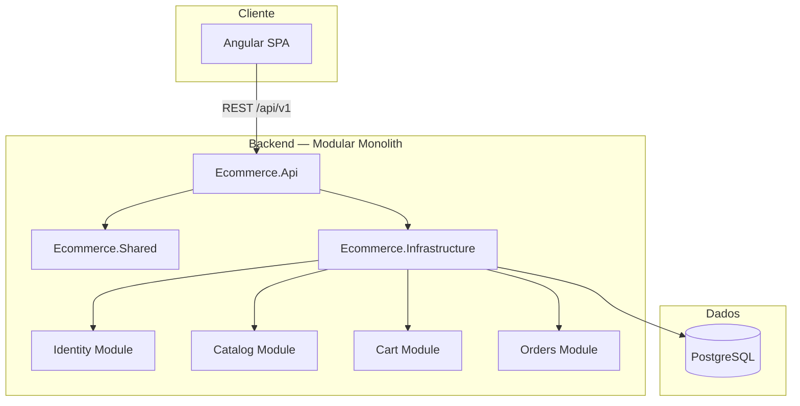

# Atelier Commerce — E-Commerce Full Stack

Monorepo de e-commerce com **backend modular em .NET 9**, **frontend Angular 19**, **PostgreSQL** e **Docker**. Inclui loja pública, painel administrativo, autenticação JWT e pipeline de qualidade (testes, lint, formatação e CI).

## Arquitetura



### Backend

| Camada | Responsabilidade |
|--------|------------------|
| **Ecommerce.Api** | Controllers, middleware, autenticação, Swagger, health checks |
| **Ecommerce.Shared** | `Result`, `Error`, behaviors MediatR, abstrações comuns |
| **Ecommerce.Infrastructure** | `DbContext` único, migrations, seed, adapters de persistência |
| **Modules.\*.Domain** | Entidades, regras de negócio, enums |
| **Modules.\*.Application** | CQRS (Commands/Queries), FluentValidation, handlers |
| **Modules.\*.Infrastructure** | Configurações EF Core (Fluent API) |

**Padrões:** CQRS com MediatR, validação com FluentValidation, ports & adapters (`I*DbContext`), JWT + refresh token, políticas `AdminOnly` / `CustomerOnly`.

**Módulos de negócio:** Identity (auth), Catalog (produtos/categorias), Cart (carrinho), Orders (pedidos/checkout).

### Frontend

| Pasta | Responsabilidade |
|-------|------------------|
| `core/` | Auth, HTTP, guards, models, interceptors |
| `features/` | Loja (catálogo, carrinho, auth) e admin (dashboard, CRUD) |
| `shared/` | Design system (`ui-*`), layout, pipes, utils |

**Padrões:** Standalone components, signals, RxJS com `takeUntilDestroyed`, serviços por domínio, `environment.ts` para API base URL.

## Stack

| Camada | Tecnologias |
|--------|-------------|
| Backend | .NET 9, ASP.NET Core, EF Core 9, PostgreSQL, MediatR, FluentValidation, Serilog, JWT, Swagger |
| Frontend | Angular 19, TypeScript, Tailwind CSS 3, Lucide Icons, RxJS |
| Infra | Docker Compose, GitHub Actions, xUnit, Karma/Jasmine, ESLint, Prettier |

## Estrutura do repositório

```
E_Commerce/
├── .github/workflows/ci.yml   # Pipeline CI
├── .editorconfig
├── docker-compose.yml
├── docker-compose.override.yml
├── docker-compose.prod.yml
├── docs/DOCKER.md
├── src/
│   ├── backend/
│   │   ├── Ecommerce.sln
│   │   ├── tests/Ecommerce.UnitTests/
│   │   └── src/               # Api, Shared, Infrastructure, Modules
│   └── frontend/              # Angular app
└── README.md
```

## Pré-requisitos

- [.NET 9 SDK](https://dotnet.microsoft.com/download)
- [Node.js 20+](https://nodejs.org/)
- [Docker Desktop](https://www.docker.com/products/docker-desktop/) (recomendado)

## Como rodar localmente

### Opção 1 — Docker (recomendado)

```powershell
copy .env.example .env
docker compose up --build
```

| Serviço | URL |
|---------|-----|
| Frontend | http://localhost:4200 |
| API / Swagger | http://localhost:5080/swagger |
| Health | http://localhost:5080/health |
| PostgreSQL | localhost:5432 |

Detalhes: [docs/DOCKER.md](docs/DOCKER.md)

### Opção 2 — Desenvolvimento nativo

```powershell
# 1. Banco
docker compose up postgres -d

# 2. API (aplica migrations + seed)
cd src\backend
dotnet run --project src\Ecommerce.Api

# 3. Frontend
cd src\frontend
npm install
npm start
```

### Credenciais de desenvolvimento

| Campo | Valor |
|-------|-------|
| Admin | `admin@ecommerce.local` |
| Senha | `Admin@123` |

## Banco de dados

- **SGBD:** PostgreSQL 16
- **Schemas lógicos:** `identity`, `catalog`, `cart`, `orders` (via EF Core)
- **Migrations:** aplicadas automaticamente no startup da API
- **Seed:** admin, roles, categoria e produto exemplo

### Comandos úteis

```powershell
cd src\backend

# Nova migration
dotnet ef migrations add NomeDaMigration `
  --project src\Ecommerce.Infrastructure `
  --startup-project src\Ecommerce.Api `
  --output-dir Persistence\Migrations

# Aplicar migrations
dotnet ef database update `
  --project src\Ecommerce.Infrastructure `
  --startup-project src\Ecommerce.Api
```

**Connection string padrão (dev):** `Host=localhost;Port=5432;Database=ecommerce;Username=ecommerce;Password=changeme`

## Health checks

| Endpoint | Descrição |
|----------|-----------|
| `GET /health` | Saúde geral da aplicação |
| `GET /health/live` | Liveness (processo ativo) |
| `GET /health/ready` | Readiness (PostgreSQL disponível) |
| `GET /api/v1/status` | Status dos módulos |

## Comandos principais

### Backend

```powershell
cd src\backend

dotnet restore
dotnet build
dotnet test
dotnet format Ecommerce.sln --verify-no-changes   # validar formatação
dotnet format Ecommerce.sln                          # aplicar formatação
dotnet run --project src\Ecommerce.Api
```

### Frontend

```powershell
cd src\frontend

npm install
npm start
npm run build
npm test
npm run test:ci          # headless (CI)
npm run lint
npm run format:check
npm run format
```

## Qualidade e CI

A pipeline [`.github/workflows/ci.yml`](.github/workflows/ci.yml) executa em cada push/PR:

| Job | Etapas |
|-----|--------|
| **backend** | restore → format check → build → testes xUnit |
| **frontend** | npm ci → prettier → eslint → build → karma (headless) |

**Testes backend** (`tests/Ecommerce.UnitTests`): domínio (produto, pedidos), `SlugNormalizer`, `Result`, FluentValidation.

**Testes frontend:** `product.utils`, `ApiErrorService`, `order.models`, `authGuard`.

**Formatação:** `.editorconfig` (raiz + backend), `dotnet format`, Prettier no frontend.

## API — visão rápida

| Área | Base path | Auth |
|------|-----------|------|
| Auth | `/api/v1/auth` | Público / JWT |
| Catálogo | `/api/v1/products`, `/categories` | Público (admin para escrita) |
| Carrinho | `/api/v1/cart` | JWT |
| Pedidos | `/api/v1/orders` | JWT |
| Admin | `/api/v1/admin` | Admin |

Documentação interativa: `/swagger` (Development).

## Próximos passos

- [ ] Testes de integração com `WebApplicationFactory` + Testcontainers
- [ ] Upload de imagens de produto (storage S3/local)
- [ ] Checkout completo no frontend (`POST /orders`)
- [ ] Pagamentos (gateway)
- [ ] E2E com Playwright/Cypress
- [ ] Observabilidade (OpenTelemetry, métricas)
- [ ] Cache de catálogo (Redis)
- [ ] Notificações por e-mail (pedido confirmado, status)

## Documentação adicional

- [Backend](src/backend/README.md)
- [Docker](docs/DOCKER.md)

## Licença

Projeto educacional / portfólio. Ajuste a licença conforme necessário.
